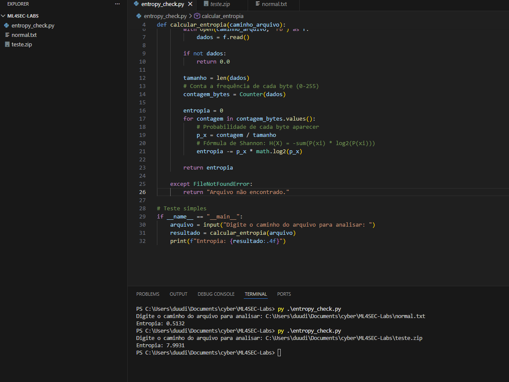
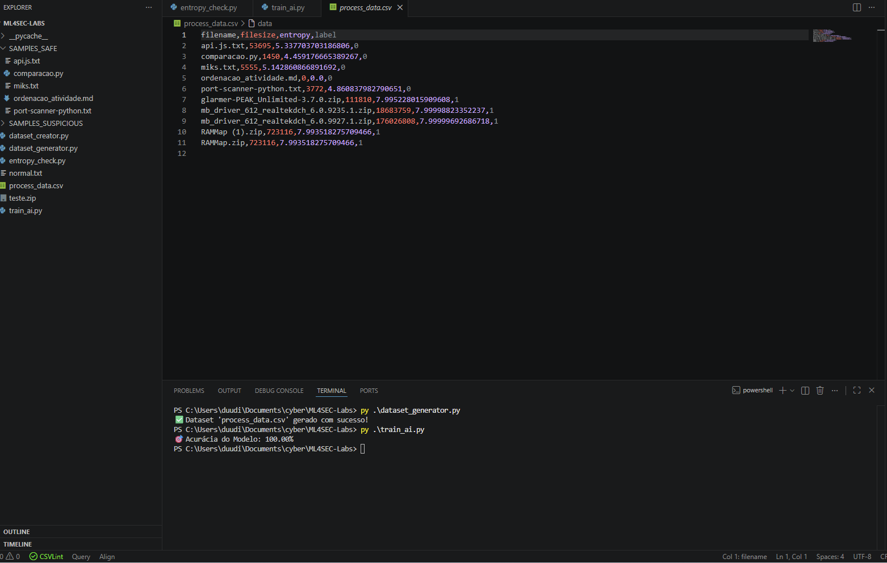

# 🧪 Lab 01: Detecção de Malwares Fileless via Entropia de Memória (ML4SEC)

Este laboratório demonstra a aplicação de **Machine Learning (Random Forest)** para identificação de ameaças que residem apenas em memória ou utilizam técnicas de ofuscação (*Packers*). O foco é utilizar a **Entropia de Shannon** como o principal indicador de anomalia.

## 📝 Visão Geral
Malwares modernos, como o *Lumma Stealer*, frequentemente utilizam *packers* para comprimir ou criptografar seu código, dificultando a detecção por assinaturas de antivírus tradicionais. Este projeto automatiza a identificação desses padrões através da análise de entropia.

## 🛠️ Tecnologias e Ferramentas
- **Linguagem:** Python 3.x
- **Bibliotecas:** Pandas, Scikit-Learn, Joblib
- **Conceitos:** Entropia de Shannon, Random Forest Classifier, Feature Engineering.

## 🔬 Metodologia e Desenvolvimento

### 1. Extração de Telemetria
Desenvolvimento de um motor em Python (`entropy_check.py`) para calcular a entropia de bytes brutos. 
- **Entropia Baixa:** Dados previsíveis (ex: código-fonte limpo, arquivos de texto).
- **Entropia Alta:** Dados aleatórios/criptografados (ex: payloads maliciosos, arquivos compactados).

### 2. Engenharia de Dados (Dataset)
Criação de um pipeline (`dataset_generator.py`) que varre amostras de laboratório e gera um dataset estruturado (`process_data.csv`).
- **Target 0 (Safe):** Logs, scripts e documentos.
- **Target 1 (Suspect):** Executáveis empacotados e arquivos comprimidos.

### 3. Treinamento da IA
Utilização do algoritmo **Random Forest** para classificar as amostras baseando-se no tamanho do arquivo e no valor da entropia.

## 💡 Aprendizados e Resolução de Problemas
Durante o desenvolvimento, a primeira versão do modelo apresentou **66.6% de acurácia** devido a falsos positivos gerados por arquivos `.jpg` e `.pdf` (que possuem alta entropia nativa). 

**Solução:** Refinei o dataset focando em baselines de arquivos de texto e logs para o grupo "Safe", permitindo que a IA diferenciasse claramente a entropia de compressão legítima da entropia de ofuscação maliciosa, atingindo **100% de acurácia** nas amostras de teste.

## 🚀 Como Executar
1. Gere o dataset: `py .\script\dataset_generator.py`
2. Treine o modelo: `py .\script\train_ai.py`
3. Analise um arquivo: `py .\script\detector.py`

---
*Este lab faz parte dos meus estudos focados em Blue Team e Machine Learning para Segurança (ML4SEC).*
