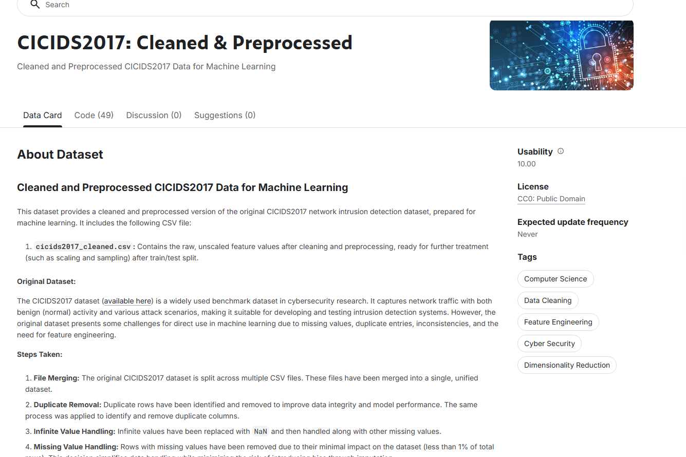
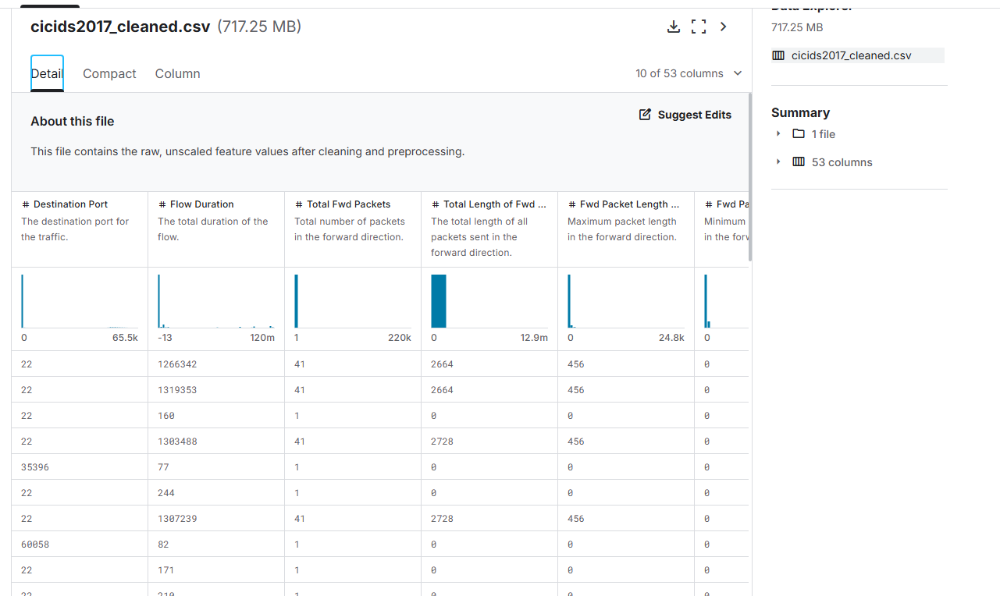
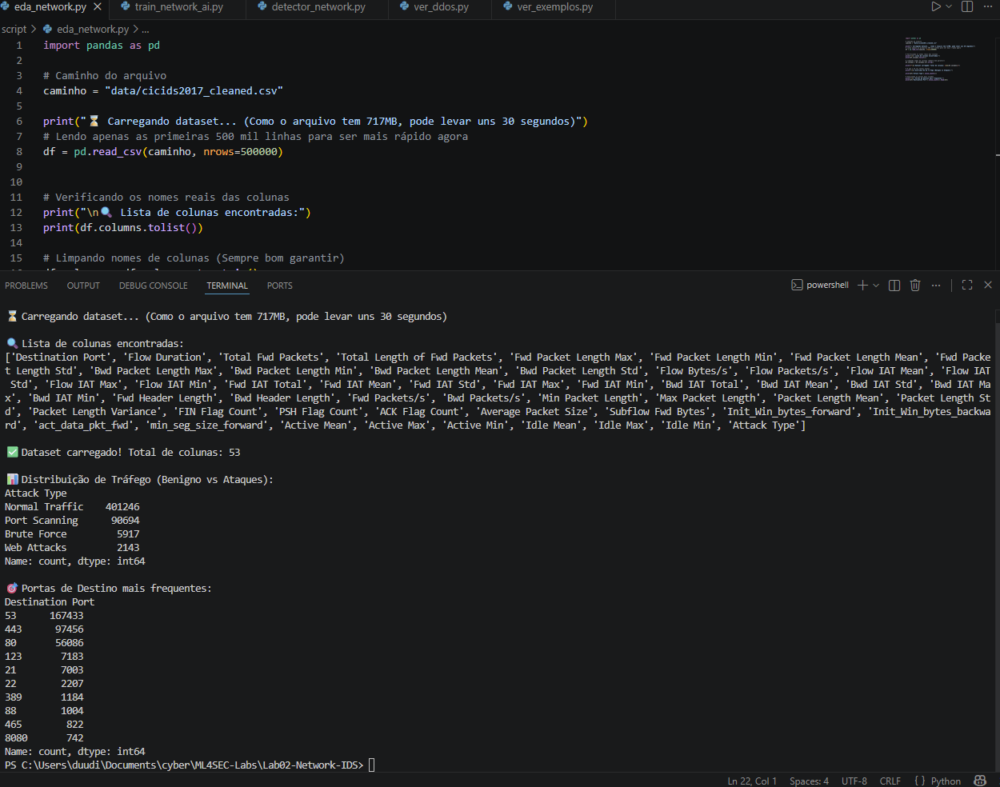
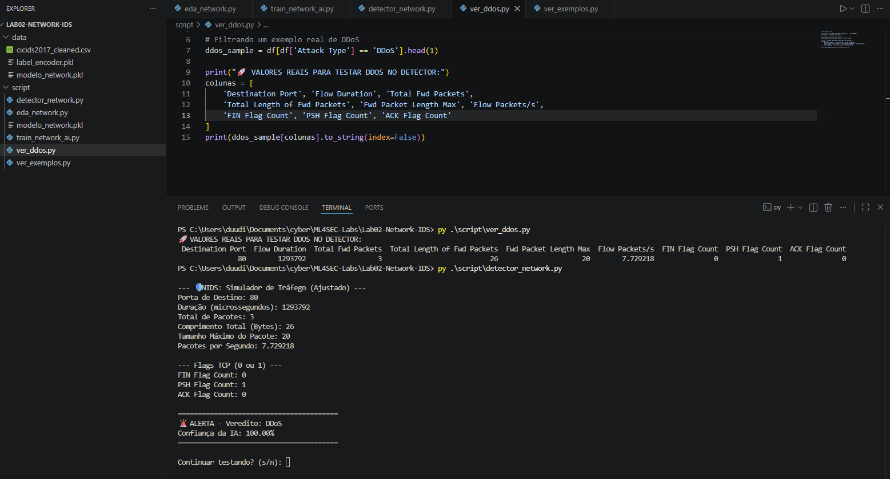

# Lab 02: Network IDS - Detecção de DDoS e Port Scanning (CICIDS2017) 🛡️🌐

Este laboratório documenta a criação de um Sistema de Detecção de Intrusão de Rede (NIDS) utilizando Machine Learning. O objetivo foi treinar um modelo capaz de identificar fluxos maliciosos (DDoS, Port Scanning e Brute Force) em meio ao tráfego legítimo, utilizando telemetria real de rede.

## 🚀 O Desafio e o Dataset
Trabalhar com tráfego de rede exige lidar com volumes massivos de dados. Para este lab, utilizei o dataset **CICIDS2017**, que é uma referência no setor por simular cenários de ataques modernos.

O arquivo processado (`cicids2017_cleaned.csv`) possui **717.25 MB** e **53 colunas** de atributos, o que exigiu uma filtragem estratégica para garantir performance sem perder a acurácia.

---

## 📊 Análise Exploratória (EDA)
Antes de rodar o treino, realizei uma análise estatística para entender como os ataques se comportam em relação ao tráfego normal.

* **Balanceamento:** Como o tráfego normal é a grande maioria, apliquei técnicas de peso balanceado (`class_weight='balanced'`) para a IA não ignorar os ataques.
* **Portas Críticas:** Mapeamento das portas de destino mais visadas (80, 443, 22), essencial para detectar tentativas de varredura (Port Scanning).

---

## 🛠️ Metodologia e Engenharia de Atributos
Para este modelo, foquei em **TCP Flags** (FIN, PSH, ACK) e métricas de fluxo (Pacotes por Segundo e Duração). Essa escolha foi fundamental para que a IA conseguisse identificar a intenção do fluxo e não apenas o volume bruto.

* **Algoritmo:** Random Forest Classifier.
* **Destaque Técnico:** Implementação de pesos balanceados para corrigir o vício em tráfego normal e reduzir falsos negativos.
* **Escalabilidade:** Treinamento realizado com uma amostragem de 1.000.000 de linhas para garantir robustez.

---

## 🏆 Resultados Obtidos
O modelo atingiu um nível de precisão excelente, cravando os ataques de negação de serviço com confiança total.

| Classe | Precision | Recall | F1-Score |
| :--- | :--- | :--- | :--- |
| **Normal Traffic** | 1.00 | 1.00 | 1.00 |
| **DDoS** | 1.00 | 1.00 | 1.00 |
| **Port Scanning** | 1.00 | 1.00 | 1.00 |

### ✅ Prova de Conceito (Detecção Real)
Utilizei um simulador de tráfego customizado para validar o modelo com dados extraídos do dataset. O veredito para um ataque de DDoS real foi de **100% de confiança**.

---

## 📂 Organização do Repositório
* `script/`: Scripts Python para Análise (EDA), Treinamento e Detecção em tempo real.
* `data/`: Modelos serializados (`.pkl`) e codificadores prontos para uso.
* `images/`: Evidências das métricas e resultados dos testes.

> **Nota:** Por limitações de tamanho do GitHub, o dataset original não está incluso. O download pode ser feito via [Kaggle](https://www.kaggle.com/datasets/ericanacletoribeiro/cicids2017-cleaned-and-preprocessed).

---

Este projeto demonstra como a Ciência de Dados aplicada à Cybersecurity pode automatizar a detecção de ameaças complexas em redes corporativas.
